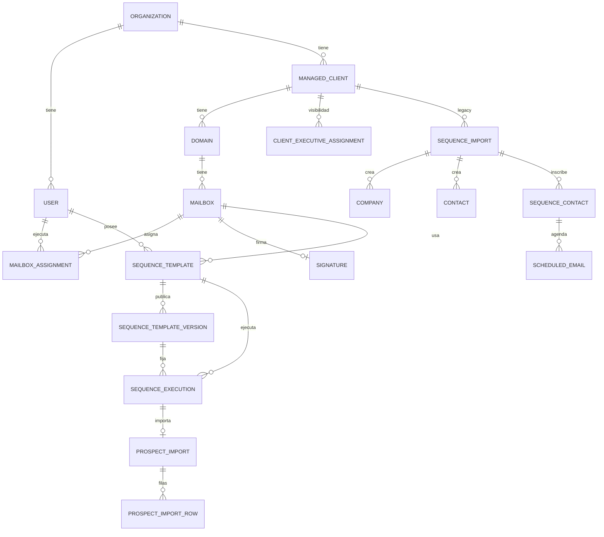
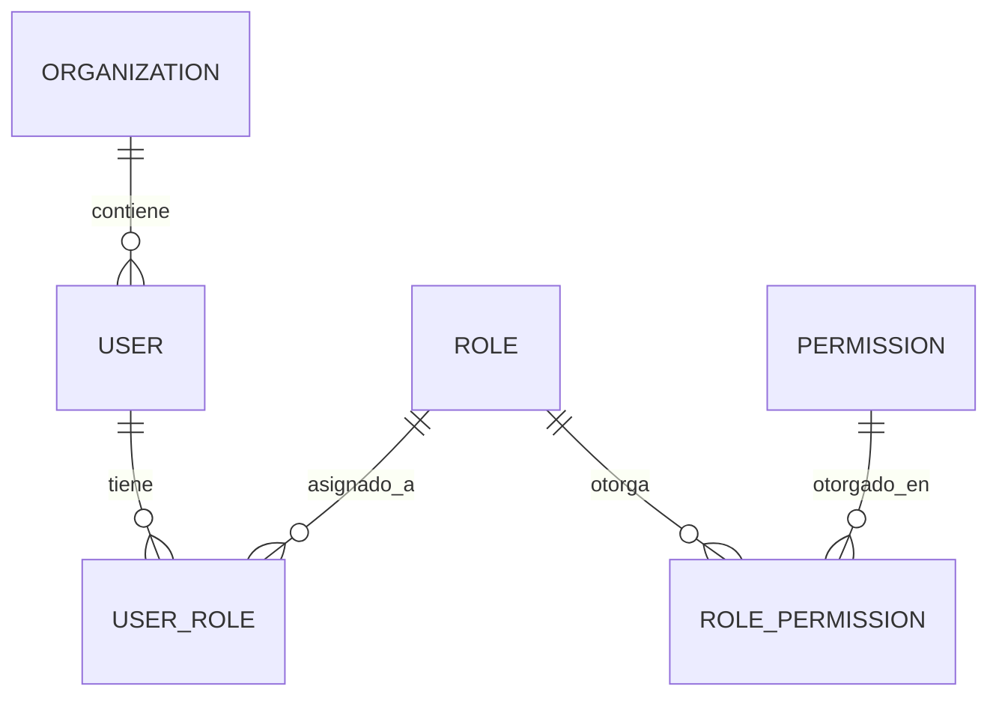
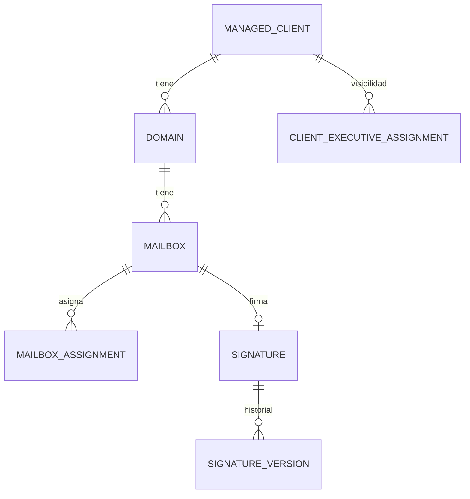
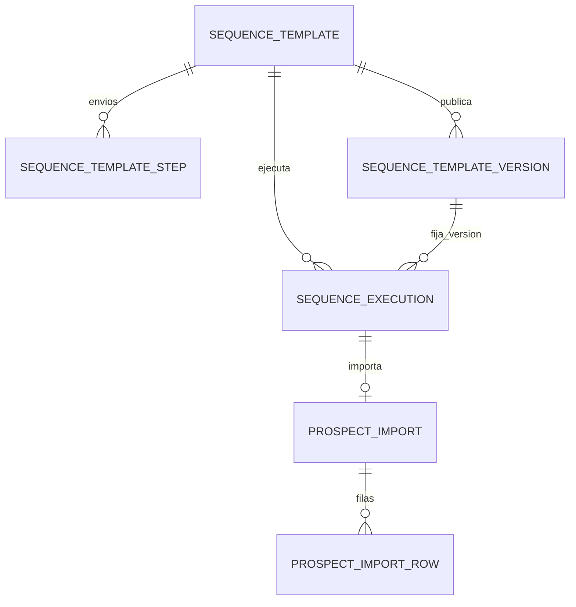
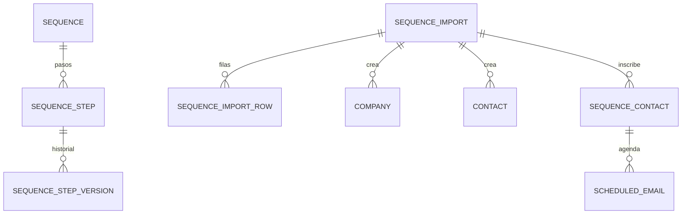

# Arquitectura de base de datos — Mr Outreach

> Documento vivo. Describe el esquema Postgres/Prisma tal como quedó tras el
> cierre de Fase E (eliminación de la dependencia CRM) y Fase F (puesta en
> marcha de `development`/`test` en el proyecto Neon "Mr Outreach"). No
> contiene hosts, usuarios, contraseñas, connection strings, datos reales ni
> IDs reales de clientes — solo nombres de tabla, columnas y relaciones.

## 1. Objetivo de la base de datos

Persistir el estado operativo de Mr Outreach: identidad y permisos internos,
la jerarquía Cliente → Dominio → Cuenta de correo, dos generaciones de
funcionalidad de envío ("Secuencias", congelada, y "Plantillas/Gestiones",
activa), el registro de comandos/eventos hacia el motor externo (Railway), y
auditoría. Mr Outreach ya no lee ningún CRM/portal externo: la identidad de
cliente/dominio/cuenta se resuelve exclusivamente a partir del payload que el
motor entrega al redimir un token de vinculación (`LinkMailboxUseCase`).

## 2. Proyecto Neon y branches

Proyecto Neon dedicado **"Mr Outreach"** (separado del proyecto "Mejoreferido",
que aloja `maestro_clientes` y no debe modificarse). Tres branches:

- `production` — vacío, sin migrar, sin tocar hasta autorización expresa.
- `development` — migrado y validado funcionalmente.
- `test` — migrado y validado; usado exclusivamente por la suite de
  integración y limpiado (`TRUNCATE`, nunca `DROP`) entre corridas.

## 3. Convención de nombres de base de datos

Los tres branches usan el nombre de base **`neondb`** (el default de Neon).
Neon distingue ambientes por branch/endpoint (hostname), no por nombre de
base — introducir nombres distintos por ambiente habría sido complejidad
sin beneficio. Decisión: mantener `neondb` en los tres.

## 4. Separación development/test/production

- `development`: para desarrollo manual y smoke tests con datos sintéticos.
- `test`: exclusivo para las suites automatizadas (integración, contratos
  Prisma). Un guard de 3 señales (`NODE_ENV=test` + `DATABASE_ENVIRONMENT=test`
  + `DATABASE_URL === TEST_DATABASE_URL` byte a byte) impide que un comando
  destructivo de test corra por accidente contra otra base
  (`apps/api/src/infrastructure/persistence/prisma/test-database-guard.ts`).
- `production`: sin migrar. Ningún comando de este proyecto debe apuntar ahí
  sin autorización explícita y separada.

## 5. Diagrama general

Diagramas por dominio funcional: ver Sección 8.

## 6. Catálogo completo de tablas (35 funcionales + `_prisma_migrations`)

| # | Tabla | Modelo Prisma | Dominio |
|---|---|---|---|
| 1 | organizations | Organization | Identidad |
| 2 | users | User | Identidad |
| 3 | roles | Role | Identidad |
| 4 | permissions | Permission | Identidad |
| 5 | user_roles | UserRole | Identidad |
| 6 | role_permissions | RolePermission | Identidad |
| 7 | audit_logs | AuditLog | Auditoría |
| 8 | integration_commands | IntegrationCommand | Integración (Secuencias) |
| 9 | integration_events | IntegrationEvent | Integración (Secuencias) |
| 10 | managed_clients | ManagedClient | Clientes/Dominios/Mailboxes |
| 11 | domains | Domain | Clientes/Dominios/Mailboxes |
| 12 | mailboxes | Mailbox | Clientes/Dominios/Mailboxes |
| 13 | mailbox_assignments | MailboxAssignment | Clientes/Dominios/Mailboxes |
| 14 | mailbox_connection_tests | MailboxConnectionTest | Clientes/Dominios/Mailboxes (legado) |
| 15 | client_executive_assignments | ClientExecutiveAssignment | Clientes/Dominios/Mailboxes |
| 16 | signatures | Signature | Firmas |
| 17 | signature_versions | SignatureVersion | Firmas |
| 18 | signature_assets | SignatureAsset | Firmas/R2 |
| 19 | templates | Template | Textos (legado, no en nav) |
| 20 | variables | Variable | Textos (activo) |
| 21 | sequences | Sequence | Secuencias (congelado) |
| 22 | sequence_steps | SequenceStep | Secuencias (congelado) |
| 23 | sequence_step_versions | SequenceStepVersion | Secuencias (congelado) |
| 24 | sequence_imports | SequenceImport | Secuencias (congelado) |
| 25 | sequence_import_rows | SequenceImportRow | Secuencias (congelado) |
| 26 | sequence_contacts | SequenceContact | Secuencias (congelado, vivo para Conversaciones) |
| 27 | scheduled_emails | ScheduledEmail | Secuencias (congelado, vivo para Conversaciones) |
| 28 | companies | Company | Empresas/Contactos (legado, vivo) |
| 29 | contacts | Contact | Empresas/Contactos (legado, vivo) |
| 30 | sequence_templates | SequenceTemplate | Plantillas (activo) |
| 31 | sequence_template_steps | SequenceTemplateStep | Plantillas (activo) |
| 32 | sequence_template_versions | SequenceTemplateVersion | Plantillas (activo) |
| 33 | sequence_executions | SequenceExecution | Gestiones (activo) |
| 34 | prospect_imports | ProspectImport | Gestiones (activo) |
| 35 | prospect_import_rows | ProspectImportRow | Gestiones (activo) |
| — | _prisma_migrations | (interna de Prisma) | Infraestructura |

Sin vistas, sin secuencias Postgres nativas (todos los IDs son UUID generados
en aplicación), 43 enums nativos.

**Hallazgo relevante**: `Conversation`/`ConversationMessage`/`ConversationTag`/
`ConversationNote` (la funcionalidad "Conversaciones") **no tienen modelo
Prisma ni tabla Postgres** — sus repositorios están cableados
incondicionalmente a la implementación en memoria en
`persistence.module.ts`, sin importar `PERSISTENCE_DRIVER`. Es decir, los
mensajes/notas/etiquetas de conversación no sobreviven un reinicio del
proceso incluso en modo `postgres`. No es parte de las 35 tablas porque
nunca llegó a persistirse — se documenta aquí como brecha conocida, no como
tarea de esta fase.

## 7. Propósito de cada tabla

Ver la matriz completa en el informe de auditoría de esta fase (mensaje de
chat) — replicada aquí de forma resumida por dominio:

### Identidad y acceso
`organizations` (tenant raíz), `users`, `roles`, `permissions` (catálogo
global, sin `organizationId` — RBAC compartido a nivel de plataforma, con
datos aplicados por organización vía `roles`), `user_roles`/`role_permissions`
(tablas puente). Sin mutación de `Role`/`Permission` en runtime hoy — RBAC es
fijo desde el seed; solo `UserRole` cambia (reasignar rol a un usuario).

### Clientes, dominios y cuentas
`managed_clients` — identidad del cliente, `source: SERVER|MANUAL`,
`serverClientId` (único global) trazable a la redención de un token.
`domains` — 1 cliente : N dominios, únicos por organización. `mailboxes` —
1 dominio : N cuentas; `linkStatus`/`linkSource` distinguen cuentas
vinculadas por token (`SERVER_TOKEN`) de cuentas manuales legadas
(`LEGACY_LOCAL`). `mailbox_assignments` — PRIMARY/SECONDARY, un único PRIMARY
por mailbox forzado en `MailboxesService`, no en la base. `client_executive_
assignments` — visibilidad ejecutivo↔cliente, separada de la asignación de
mailbox (`MANUAL` vs `MAILBOX_DERIVED`).

### Firmas y R2
`signatures` (1:1 con mailbox), `signature_versions` (historial inmutable,
cada edición crea una versión nueva), `signature_assets` (metadatos de
imágenes; el binario vive en Cloudflare R2, nunca en Postgres). Un asset no
se borra si está referenciado en el HTML de alguna plantilla/versión.

### Plantillas y Gestiones (activo)
`sequence_templates`/`steps`/`versions` — una Plantilla pertenece a un
ejecutivo y a un mailbox; publicar congela un snapshot inmutable
(`SequenceTemplateVersion`) que una `SequenceExecution` en curso sigue
usando aunque se publique una versión nueva. `sequence_executions` — una
Gestión, con máquina de estados DRAFT→...→COMPLETED/FAILED/REJECTED;
`prospect_imports`/`rows` — el archivo subido, 1:1 con una ejecución.
Railway administra el envío real; no existe cola local de correos para
Gestiones (a diferencia de Secuencias).

### Secuencias (congelado) y Empresas/Contactos
`sequences`/`sequence_steps`/`sequence_step_versions`/`sequence_imports`/
`sequence_import_rows`/`sequence_contacts`/`scheduled_emails` — sistema
anterior, sin entrada de navegación activa, pero con endpoints backend
todavía registrados y usados por Conversaciones para atribución. `companies`/
`contacts` — creadas únicamente por el flujo legado de importación
(`ConfirmProspectImportUseCase`); el flujo nuevo de Gestiones nunca las toca.

### Integración (comandos/eventos)
`integration_commands`/`integration_events` — patrón Outbox/Inbox usado
**solo** por el flujo legado (vinculación/aprovisionamiento de mailbox,
publicación de Secuencias, importación legada). El flujo nuevo de
Plantillas/Gestiones habla con el motor por HTTP directo, sin pasar por
estas tablas.

### Auditoría
`audit_logs` — de solo escritura (append-only), ~90 acciones distintas
detectadas. Sin política de retención implementada; sin índice sobre
`createdAt` (solo sobre `organizationId`) — candidato a mejora futura si el
volumen crece.

## 8. Diagramas por dominio

## 9. Reglas multiempresa

32 de 35 tablas tienen columna `organizationId` directa e indexada. Las 3
excepciones son hijas inmutables de una entidad ya aislada, y heredan el
aislamiento vía FK: `SequenceStepVersion` (→ `SequenceStep.organizationId`),
`SequenceTemplateVersion` (→ `SequenceTemplate.organizationId`),
`SignatureVersion` (→ `Signature.organizationId`). `Permission` es un
catálogo global intencional (no es dato de un tenant). `UserRole`/
`RolePermission` son tablas puente sin columna propia, aisladas vía sus FK.

El patrón de servicio dominante es `requireOwned(...)`: cada lectura por ID
compara `entity.organizationId === user.organizationId` antes de continuar
y devuelve 404/409 en caso contrario — confirmado en Clients, Domains,
Mailboxes, SequenceTemplates, SequenceExecutions. No se encontró una ruta que
permita vincular recursos de dos organizaciones distintas.

## 10. Identificadores externos — decisión documentada

| Campo | Unicidad actual en Prisma | Evidencia de que el motor la garantiza | Decisión |
|---|---|---|---|
| `ManagedClient.serverClientId` | `@unique` (global) | **Sí, explícita** — comentario "Fase 2.1: single, shared external Railway id space, never scoped per organization" en `in-memory-managed-client.repository.ts` y en el test de contrato correspondiente | **Opción A confirmada** — no requiere cambio |
| `Mailbox.serverMailboxId` | `@unique` (global) | Parcial — la base lo enfuerza y un test de integración verifica que una segunda organización no puede vincular el mismo `serverMailboxId`, pero **no existe un comentario o doc que declare que el motor mismo garantiza unicidad global** de su lado | **Opción A ya implementada y probada, pero sin confirmación contractual explícita del motor** — no se modifica el esquema; queda como riesgo documentado |
| `Mailbox.serverDomainId` | Sin restricción de unicidad (ni `@unique` ni compuesta) | **Ninguna** — ni en el contrato (`docs/motor-mailbox-link-contract-v1.md`), ni en los adaptadores HTTP/simulado, ni en pruebas | **Ambigüedad reportada, sin cambio.** Si se necesita unicidad en el futuro, decidir entre Opción A (global) u Opción B (`@@unique([organizationId, serverDomainId])`) solo cuando el motor real confirme su espacio de IDs |

No se modificó el esquema como resultado de este hallazgo — se documenta la
ambigüedad de `serverDomainId` para que una fase futura la resuelva con
evidencia real del motor, no por inferencia.

## 11. Flujo de vinculación por token

1. `POST /mailboxes/link-token/introspect` (opcional, solo lectura) →
   `MailboxMotorPort.introspectLinkToken`.
2. `POST /mailboxes/link` → `LinkMailboxUseCase.execute`:
   a. Chequeo de idempotencia (`idempotency_commands`, ver comandos).
   b. `motor.redeemLinkToken(...)` — **fuera** de cualquier transacción
      Postgres (el motor es la fuente de verdad externa).
   c. Una única transacción Prisma: `ManagedClient` (upsert), `Domain`
      (find-or-create), validación autoritativa del ejecutivo,
      `Mailbox` (create, `linkStatus=ACTIVE`), `MailboxAssignment`
      (PRIMARY + SECONDARY*), `ClientExecutiveAssignment`
      (`MAILBOX_DERIVED`), `AuditLog` (`mailbox.link`), registro del
      comando de idempotencia.
3. Redención repetida del mismo token por la misma organización devuelve el
   mismo resultado (idempotente, verificado en
   `link-mailbox.integration.spec.ts`); por otra organización, `ConflictException`.

## 12. Flujo de creación y publicación de Plantilla

Borrador (`SequenceTemplate`, `status=DRAFT`) con 3 `SequenceTemplateStep`
fijos → edición de asunto/firma/cada envío → `POST :id/publish` →
`PublishSequenceTemplateUseCase`: congela snapshot (`subjectTemplate`,
`signatureHtml`, `variables`, `steps[]`) en `SequenceTemplateVersion`
(`status=REQUESTED`) → llama al motor → actualiza la versión
(`ACCEPTED`/`FAILED`) → actualiza la plantilla (`PUBLISHED`/`PUBLISH_FAILED`).
Nada bloquea editar el contenido de una plantilla con una Gestión activa —
la protección real es estructural: cada `SequenceExecution` fija su propia
`templateVersionId` inmutable.

## 13. Flujo de creación de Gestión

`SequenceExecution` (DRAFT, ejecutivo+mailbox+plantilla+versión aceptada) →
subir archivo (`ProspectImport`, 1:1 con la ejecución) → mapear columnas
(`ProspectImportRow`, JSON denormalizado, sin crear `Company`/`Contact`) →
`POST :id/start` → validaciones (mailbox elegible, versión `ACCEPTED`,
import `READY`, filas válidas) → `SUBMITTING` → llamada al motor →
`ACCEPTED`/`REJECTED`/`SUBMISSION_UNKNOWN`. Sin Outbox/Inbox local; sondeo
manual vía `POST :id/refresh-status` (no hay push del motor).

## 14. Flujo de importación de prospectos (legado, Secuencias)

Archivo → `SequenceImport` (`UPLOADED`) → mapeo (`MAPPING_REQUIRED`→`READY`)
→ `POST /sequence-imports/:id/confirm` → `ConfirmProspectImportUseCase`
(una única transacción): crea `Company`/`Contact` (evitando duplicados vía
los índices parciales case-insensitive), inscribe `SequenceContact`, marca
filas (`SequenceImportRow`), completa el import, audita, encola un comando
de integración (`SEQUENCE_IMPORT_REQUESTED`).

## 15. Comandos y eventos

`IntegrationCommand`/`IntegrationEvent` implementan un patrón Outbox/Inbox
para el flujo legado (vinculación/aprovisionamiento de mailbox, publicación
de Secuencias, importación legada, remoción de contacto/empresa). Estados
`REQUESTED→ACCEPTED→PROCESSING→COMPLETED/FAILED/CANCELLED/TIMEOUT`.
`commandId`/`correlationId`/`idempotencyKey` evitan doble ejecución;
`payloadHash`+`resultSnapshot` permiten repetir una respuesta idéntica ante
un reintento con la misma clave. El flujo nuevo (Plantillas/Gestiones) no
usa estas tablas — habla con el motor por HTTP directo con sus propios
`commandType` de protocolo (no persistidos como filas).

## 16. Auditoría

`AuditLog` es de solo escritura; casi todos los módulos escriben en algún
punto (~90 valores de `action` detectados), con la excepción notable de
mutaciones simples de `SequenceTemplate` (crear/editar contenido — sí se
audita el ciclo de publicación). Sin política de retención ni índice por
fecha todavía — riesgo de crecimiento a vigilar, no urgente hoy.

## 17. Retención (resumen — detalle en el informe de esta fase)

Sin implementar ninguna política destructiva en esta fase. Recomendaciones
quedan documentadas como trabajo futuro: `audit_logs`/`integration_events`/
`integration_commands` como candidatos a archivado por antigüedad;
`prospect_import_rows`/`sequence_import_rows` como candidatos a purga tras
el cierre de la Gestión/importación que los originó, si el volumen lo
justifica.

## 18. Tablas candidatas a revisión (recomendación futura, no ejecutada)

- `mailbox_connection_tests` + campos legados de `Mailbox` (imap/smtp) —
  solo alcanzables desde la creación manual de mailbox (`POST /mailboxes`),
  disjunta del flujo de vinculación por token.
- `templates` — controlador y página existen pero sin enlace de navegación.
- `sequences`/`sequence_steps`/`sequence_step_versions`/`sequence_imports`/
  `sequence_import_rows` — sin página alcanzable desde el nav; el backend
  sigue vivo porque Conversaciones lo consume para atribución histórica.
- `integration_commands`/`integration_events` — quedarían huérfanas si el
  flujo legado se retira por completo; hoy siguen activas.

Ninguna de estas tablas fue eliminada, ni se planea eliminarla en esta fase.

## 19. Decisiones pendientes

- Confirmar con el motor real (cuando exista) si `serverDomainId` debe ser
  único, y con qué alcance.
- Definir el contrato de "consulta en vivo de estado de cliente" antes de
  implementar `ClientEligibilityService.assertEligibleForPublish` más allá
  del snapshot local (TODO explícito en el código, no implementado).
- Decidir si `Conversation`/`Message`/notas/etiquetas deben pasar a Postgres
  (hoy en memoria, se pierden al reiniciar el proceso).
- Evaluar en una fase posterior, con más evidencia de uso real, si el
  sistema "Secuencias" (congelado) puede retirarse una vez que Conversaciones
  deje de depender de él para atribución.

## 20. Fase "Conversaciones persistentes y atribución al flujo activo" — cambios aplicados

Migración `20260731000000_persist_conversations_and_active_flow_attribution`
(aditiva, aplicada en `development` y `test`, nunca en `production`).

### 20.1 Conversaciones — de memoria a Postgres

6 tablas nuevas: `conversations`, `conversation_messages`, `conversation_tags`,
`conversation_tag_assignments`, `conversation_notes`, `conversation_read_states`.
`ConversationRepository`/`ConversationMessageRepository`/`ConversationTagRepository`/
`ConversationNoteRepository` ahora se ramifican por `PERSISTENCE_DRIVER` en
`persistence.module.ts`, igual que el resto de repositorios — antes estaban
cableados incondicionalmente a la implementación en memoria.

`ConversationReadState` (nueva) es la fuente de verdad de leído/no-leído
**por usuario**; `Conversation.isUnread` se mantiene como señal global no
autoritativa (documentado en el propio modelo Prisma). `ConversationsService.
getById` ahora registra el estado de lectura del usuario que abrió la
conversación, sin afectar el de los demás.

Atribución: `Conversation` agrega `sequenceExecutionId`/`prospectImportRowId`
(flujo activo) junto a los campos legacy ya existentes
(`sequenceContactId`/`originatingScheduledEmailId`/`sequenceId`/`sequenceStepId`),
todos nullable, más un enum `ConversationOrigin` (`ACTIVE_EXECUTION` |
`LEGACY_SEQUENCE` | `EXTERNAL_INBOUND`) que cada punto de creación fija
explícitamente — nunca se infiere del origen por qué FKs están pobladas.

### 20.2 Company/Contact en el flujo activo — `ProspectIdentityResolver`

Nuevo servicio (`application/prospect-imports/prospect-identity-resolver.service.ts`)
que, tras la aceptación de una Gestión, resuelve/crea `Company`/`Contact`
reutilizando exactamente las mismas tablas e índices únicos case-insensitive
que ya usa el flujo legado — nunca una tabla paralela. `ProspectImportRow`
gana `companyId`/`contactId`/`resolvedAt` (nullable, nunca se sobrescriben
una vez resueltos). Sin correo válido, la fila queda sin resolver, nunca
rechazada.

### 20.3 `IntegrationCommand` para el flujo activo (Alternativa A)

`IntegrationAggregateType` gana `TEMPLATE` y `EXECUTION`. `PublishSequenceTemplateUseCase`
y `StartSequenceExecutionUseCase` ahora crean/actualizan una fila `IntegrationCommand`
(`TEMPLATE_PUBLISH_REQUESTED`/`SEQUENCE_EXECUTION_START_REQUESTED`) durable,
sin duplicar `commandId`/`correlationId` como columnas propias — se consultan
por `(organizationId, aggregateType, aggregateId)`. Patrón de 3 etapas:
Etapa A (transacción local: claim de estado + IntegrationCommand REQUESTED),
Etapa B (llamada al motor, fuera de cualquier transacción), Etapa C
(transacción de resultado: entidad + IntegrationCommand + auditoría). Un
fallo entre Etapa A y B deja el comando en `REQUESTED` — recuperación
manual únicamente (un nuevo intento reutiliza la misma `idempotencyKey`),
nunca automática.

### 20.4 `Domain.serverDomainId`

Campo nuevo en `Domain` (antes solo existía como snapshot en
`Mailbox.serverDomainId`) con `@@unique([organizationId, serverDomainId])`
provisional — sin evidencia contractual de unicidad global del motor.
Poblado por `LinkMailboxUseCase` al crear el `Domain`; filas preexistentes
quedan `null` hasta un futuro relink.

### 20.5 Contrato `OPERATIONAL_STATUS_CHECK` — documentado, NO implementado

Por instrucción expresa, este bloqueador permanece abierto. No se creó
ningún puerto, adaptador HTTP, ni respuesta simulada. **El contrato
completo y definitivo (21 secciones, listo para entregar al equipo
responsable del motor) vive en
[`docs/operational-status-check-contract-v1.md`](./operational-status-check-contract-v1.md)**
— lo que sigue aquí es solo el resumen original de la fase anterior,
conservado para no romper el historial de esta sección. Contrato propuesto
para aprobación futura del equipo del servidor:

| Elemento | Propuesta |
|---|---|
| Endpoint/comando | `POST /operational-status/check` (o `OPERATIONAL_STATUS_CHECK` si el motor usa un bus de comandos) |
| Request | `{ serverClientId, serverDomainId?, serverMailboxId?, correlationId, idempotencyKey }` |
| Response | `{ serverClientId, serverDomainId, serverMailboxId, clientStatus, domainStatus, mailboxStatus, checkedAt, blockReasonCode, blockReason, motorStatusCode }` |
| Autenticación | Sin definir por el motor todavía. Si Mr Outreach termina siendo quien LLAMA a este endpoint (no quien lo recibe), la autenticación la exige el motor, no este proyecto — no hay nada que decidir aquí hasta que el equipo del motor publique su propio mecanismo. Si en cambio el motor prefiriera empujar el resultado como un evento entrante (en vez de que Mr Outreach lo consulte activamente), el mecanismo HMAC ya construido para `POST /integration/events` (Fase "Recepción de eventos del motor" — ver §22) es reutilizable tal cual: mismo esquema de firma, mismo `MotorEventAuthenticator`, sin inventar un segundo mecanismo. Ninguna de las dos formas está decidida; ambas quedan documentadas como opciones, no como implementación. |
| Timeout | 5s, igual al resto de adaptadores HTTP existentes |
| Reintentos | 1, solo en timeout/5xx |
| Fail-closed | timeout, 5xx, estado desconocido, o cualquier entidad inactiva → bloquear, nunca asumir elegibilidad |
| Transacción | La llamada al motor nunca ocurre dentro de una transacción Postgres abierta; el snapshot se actualiza en una transacción nueva, posterior a la respuesta |

`ClientEligibilityService.assertEligibleForPublish` sigue evaluando solo el
snapshot local — este bloqueador **no se marca como resuelto**. La Fase
"Recepción de eventos del motor" (§22) no lo resuelve tampoco: construye la
recepción genérica de eventos del motor para el flujo activo (Plantillas/
Gestiones), no una llamada de verificación de estado operativo — son
contratos distintos que solo comparten, opcionalmente, el mecanismo de
autenticación HMAC si el equipo del motor así lo decide.

## 21. Matriz final de identificadores externos

| Identificador | Entidad | Unicidad actual | Evidencia contractual | Recomendación |
|---|---|---|---|---|
| `serverClientId` | ManagedClient | `@unique` global | Explícita (Fase 2.1) | Sin cambio |
| `serverDomainId` | Domain (nuevo) | `@@unique([organizationId, serverDomainId])` | Ninguna | Provisional, revisar si el motor confirma unicidad global |
| `serverMailboxId` | Mailbox | `@unique` global | Parcial (enforced+testeado, sin declaración del motor) | Sin cambio, riesgo documentado |
| `serverTemplateId` | SequenceTemplateVersion | `@unique` global | Ninguna | Provisional |
| `serverExecutionId` | SequenceExecution | `@unique` global | Ninguna | Provisional |
| `serverMessageId` | ConversationMessage (nuevo) | `@@unique([organizationId, serverMessageId])` | Ninguna | Provisional |
| `outboundMessageId` | ConversationMessage (nuevo) | `@@unique([organizationId, outboundMessageId])` | Ninguna | Provisional |
| `messageIdHeader` | ConversationMessage (nuevo) | `@@unique([organizationId, messageIdHeader])` | N/A (header RFC822, no del motor) | Conservadora por diseño |
| `commandId` | IntegrationCommand | `@unique` (legacy); no columna propia en TEMPLATE/EXECUTION | N/A — interno | Se consulta por `(organizationId, aggregateType, aggregateId)` |
| `correlationId` | IntegrationCommand | Indexada, no única | N/A — interno | Sin cambio |
| `idempotencyKey` | IntegrationCommand | `@@unique([organizationId, idempotencyKey])` | N/A — interno | Sin cambio |

Ningún esquema fue modificado más allá de lo explícitamente listado en la
sección 20 — todas las demás filas de esta matriz permanecen como
recomendaciones para cuando exista evidencia real del motor.

## 22. Fase "Recepción de eventos del motor" — cambios aplicados

Reutiliza íntegramente la infraestructura de Outbox/Inbox descrita en la
sección 15 (`IntegrationCommand`/`IntegrationEvent`) en vez de crear un
segundo sistema de eventos — confirmado tras auditar `IntegrationService`,
que documenta explícitamente no tener lógica de efectos de dominio,
dejando espacio para que esta fase agregue esa lógica en un servicio
nuevo y separado (`MotorEventProjector`) sin tocar el mecanismo de
persistencia existente.

**Contrato de evento** — `EventEnvelope` (ya existente en
`domain/integration/envelopes.ts`) se extiende con `aggregateType?` y
`aggregateId?` opcionales; conserva `schemaVersion`, `eventId`,
`eventType`, `commandId`, `correlationId`, `organizationId`, `occurredAt`,
`payload` sin cambios de nombre. 8 `EventType` nuevos, exclusivos del
flujo activo (nunca reutilizados por el simulador legado de
Mailbox/Secuencias): `EXECUTION_ACCEPTED`, `EXECUTION_PROCESSING`,
`OUTBOUND_MESSAGE_CREATED`, `OUTBOUND_MESSAGE_SENT`,
`INBOUND_MESSAGE_RECEIVED`, `EXECUTION_COMPLETED`, `EXECUTION_FAILED`,
`FUTURE_JOBS_CANCELLED`.

**`IntegrationEvent`** gana 6 columnas (`aggregateType`, `aggregateId`,
`occurredAt`, `errorCode`, `failedAt`, `attempts`) y 3 estados nuevos en
`IntegrationEventProcessingStatus` (`PROCESSING`, `FAILED_RETRYABLE`,
`FAILED_TERMINAL`) — los 3 estados legado (`RECEIVED`/`PROCESSED`/
`FAILED`) se mantienen intactos para el simulador. La restricción
`@@unique([organizationId, eventId, origin])` ya existente se conserva
sin cambios — el nuevo origen `REMOTE` obtiene su propio espacio de
deduplicación sin requerir migración adicional.

**Autenticación** — `POST /integration/events` no usa `JwtAuthGuard`: la
llamada la hace el motor externo, no un usuario logueado. Firma HMAC-SHA256
sobre `${timestamp}.${rawBody}` (mismo esquema que Stripe/GitHub),
verificada con comparación de tiempo constante
(`crypto.timingSafeEqual`). Fail-closed: sin `MOTOR_EVENT_HMAC_SECRET`
configurado, el endpoint responde 404 en todo ambiente (nunca solo en
producción) — su existencia nunca se filtra ni se acepta un evento sin
firma "por ahora".

**Procesamiento en dos etapas** — Etapa A (una transacción: deduplicar
por `eventId`+`origin`, crear la fila en `RECEIVED` si es nueva) y Etapa B
(una segunda transacción: reclamar atómicamente vía
`conditionalClaimForProcessing` — un `UPDATE ... WHERE status IN (...)`
que retorna 0 si otra entrega concurrente ya lo tomó —, proyectar,
marcar `PROCESSED`/`FAILED_RETRYABLE`/`FAILED_TERMINAL`). Ninguna llamada
externa ocurre dentro de una transacción. Una violación de la restricción
única durante una carrera genuina entre dos entregas concurrentes del
mismo `eventId` se recupera releyendo la fila ganadora en una conexión
nueva (Postgres aborta toda la transacción ante ese conflicto — la
relectura nunca puede ocurrir dentro de la misma transacción abortada).

**Proyección al flujo activo** — `OUTBOUND_MESSAGE_CREATED` es el primer
punto que crea una `Conversation` con `origin = ACTIVE_EXECUTION`,
resolviendo `SequenceExecution`/`ProspectImportRow`/`Mailbox`/`Company`/
`Contact`/ejecutivo asignado. Identidad de hilo por prioridad: threadId
del motor → `outboundMessageId` → `exec_{executionId}_row_{rowId}` — nunca
el asunto solo. `INBOUND_MESSAGE_RECEIVED` resuelve la conversación por
prioridad: `In-Reply-To` → `References` (en orden inverso) →
`outboundMessageId` → `serverExecutionId`+`prospectImportRowId` →
mailbox+email normalizado (último recurso) → si nada resuelve, crea una
conversación `EXTERNAL_INBOUND` nueva sin rechazar el evento. La relación
con `IntegrationCommand` (Fase 10) nunca acepta un `commandId` de otra
organización — `findByCommandId` ya está scoped por `organizationId`, así
que un `commandId` ajeno simplemente no se encuentra (se audita como
`command_not_found`, nunca se crea un comando ficticio).

**Lectura por usuario** — `ConversationReadState` (ya existente desde la
sección 20) sigue siendo la única fuente de verdad por usuario; esta fase
no le agrega escritura en la llegada de un mensaje (solo se escribe
cuando un usuario abre la conversación). El campo `Conversation.isUnread`
que hoy expone `ConversationSummary` sigue siendo el flag global heredado
del sync IMAP legado — **no** se consulta `ConversationReadState` todavía
para calcular ese campo por usuario. Esto es una limitación conocida y
documentada, no un error: la independencia por usuario ya es
comprobable a nivel de almacenamiento (ver
`conversation-persistence.integration.spec.ts` y el nuevo
`motor-events.e2e-spec.ts`), pero el badge/contador visible en pantalla
todavía no deriva de ahí. Conectar ambas cosas queda fuera del alcance
de esta fase.

**Simulador** (`dev/motor-events/:executionId/emit`) — construye un
`MotorEventEnvelopeDto` real (mismo `eventId` generado, mismo
`commandId`/`correlationId` reutilizados del `IntegrationCommand` de la
ejecución cuando existe) y lo pasa por el mismo `ProcessMotorEventUseCase`
que usa el endpoint HTTP real — nunca una ruta de persistencia paralela.
Gateado exactamente como `DevSimulatedExecutionsController`: 404 salvo
`SEQUENCE_MOTOR_MODE=simulated` y `NODE_ENV!=='production'`.

**Reintento manual** (`POST /integration/events/:eventRowId/retry-projection`,
permiso `integration_events.retry`, admin-only — el mismo permiso ya
usado por el reprocesador legado del simulador, sin crear uno nuevo) —
solo acepta eventos en `FAILED_RETRYABLE`; un evento `FAILED_TERMINAL`
nunca se reintenta automática ni manualmente. Cada intento incrementa
`attempts`; al alcanzar `MAX_PROJECTION_ATTEMPTS` (5) un fallo retryable
se degrada a terminal.
